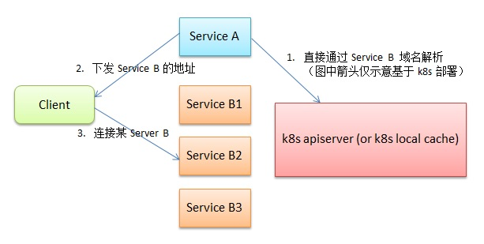

## 本例的典型架构




## 例子文件介绍

文件名          | 说明
---------------| ------------------------------------
build.sh       | 构建 服务A 服务B 的docker镜像
Dockerfile     | 服务A 服务B 的Dockerfile
service_a.go   | 服务A 实现
service_a.yaml | 服务A k8s编排脚本
service_b.go   | 服务B 实现
service_b.yaml | 服务B k8s编排脚本


## 服务A介绍

代码如下：

```go
var counter = 0

func handle(w http.ResponseWriter, r *http.Request) {
	r.ParseForm()
	lt, err := net.LookupIP("service-b")
	if err == nil {
		index := counter % (len(lt))
		counter = counter + 1
		fmt.Fprintf(w, fmt.Sprintf("%v", lt[index]))
	} else {
		fmt.Fprintf(w, "")
	}
}

func main() {
	http.HandleFunc("/", handle)
	err := http.ListenAndServe(":8000", nil)
	if err != nil {
		log.Fatal("ERROR: ", err)
	}
}
```

主要通过 net.LookupIP("service-b"), 获取服务B IP列表，并选择其中之一发给客户端

服务B 的 域名为 service-b， k8s根据服务A的编排脚本会在内部会自动生成。

## 服务B介绍

典型的回显服务器

主要介绍下 service_b.yaml 编排脚本原理：

```yaml
apiVersion: extensions/v1beta1
kind: DaemonSet
metadata:
  name: service-b
  namespace: k8s-example1
  labels:
    app: service-b
spec:
  template:
    metadata:
      labels:
        app: service-b
    spec:
      hostNetwork: true
      containers:
      - name: service-b
        image: fananchong/k8s-example1
        command: [ "/service_b" ]

---
apiVersion: v1
kind: Service
metadata:
  name: service-b
  namespace: k8s-example1
  labels:
    app: service-b
spec:
  ports:
    - port: 3456
  clusterIP: None
  selector:
    app: service-b
```

  - 服务B 部署方式为 DaemonSet，每台开1个进程(当然可以加node selector，使符合条件的机器开1个进程)

  - 服务B 使用 Host 网络，这样才能给提供客户端服务

  - 服务B的服务发现使用 Headless Service 类型。这样，其他k8s服务就可以直接 nds解析，获取 服务B 地址列表。如上面的go代码：net.LookupIP("service-b")

  - 因为对外服务，因此port直接硬编码。

## 总结

  - 通过k8s，可以达成非代码侵入式的服务发现机制
  - 需要知道其他服务，唯一条件是需要知道它的服务名。这通常可以硬编码或配置中获取
