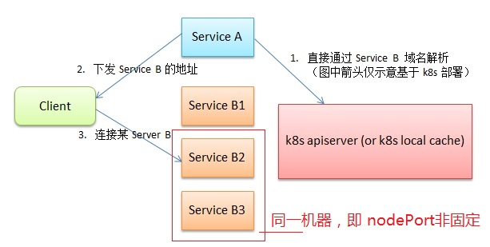

## 本例的典型架构




## 例子文件介绍

文件名          | 说明
---------------| ------------------------------------
build.sh       | 构建 服务A 服务B 的docker镜像
Dockerfile     | 服务A 服务B 的Dockerfile
k8s_api.go     | Kubernetes Custom Seed Provider. 辅助服务发现
service_a.go   | 服务A 实现
service_a.yaml | 服务A k8s编排脚本
service_b.go   | 服务B 实现
service_b.yaml | 服务B k8s编排脚本


## 服务A介绍

代码如下：

```go
func handle(w http.ResponseWriter, r *http.Request) {
	lt := GetEndpoints("k8s-example2", "service-b", 3000)
	if lt != nil {
		index := rand.Intn(len(lt))
		fmt.Fprintf(w, fmt.Sprintf("%v", lt[index]))
	} else {
		fmt.Fprintf(w, "")
	}
}

func main() {
	rand.Seed(time.Now().UnixNano())
	http.HandleFunc("/", handle)
	err := http.ListenAndServe(":8000", nil)
	if err != nil {
		log.Fatal("ERROR: ", err)
	}
}
```

主要通过 GetEndpoints("k8s-example2", "service-b", 3000), 获取服务B IP列表，并选择其中之一发给客户端

"k8s-example2", "service-b", 3000 均为 服务B相关的硬编码，可配置。

## 服务B介绍

典型的回显服务器

主要介绍下 service_b.yaml 编排脚本原理：

```yaml
apiVersion: apps/v1
kind: StatefulSet
metadata:
  name: service-b
  namespace: k8s-example2
  labels:
    app: service-b
spec:
  serviceName: service-b
  selector:
    matchLabels:
      app: service-b
  replicas: 3
  template:
    metadata:
      labels:
        app: service-b
    spec:
      hostNetwork: true
      dnsPolicy: ClusterFirstWithHostNet
      containers:
      - name: service-b
        image: fananchong/k8s-example2
        command: [ "/service_b" ]
        env:
        - name: POD_NAME
          valueFrom:
            fieldRef:
              fieldPath: metadata.name
        - name: POD_NAMESPACE
          valueFrom:
            fieldRef:
              fieldPath: metadata.namespace
---
apiVersion: v1
kind: Service
metadata:
  name: service-b
  namespace: k8s-example2
  labels:
    app: service-b
spec:
  ports:
    - port: 3456
  clusterIP: None
  selector:
    app: service-b
```

  - 服务B 部署方式为 StatefulSet ，使得每个Pod有唯一ID

  - 服务B 使用 Host 网络，这样才能给提供客户端服务

  - 服务B的服务发现使用 Headless Service 类型。这样，其他k8s服务就可以直接 nds解析，获取 服务B 地址列表。

  - Port根据 base + Pod有唯一ID，使得服务B的每个容器均有唯一的对外Port。且其他服务可根据Pod名直接知道它的Port号

## 总结

  - 需要通过 k8s_api.go 文件中的 2个 函数，来达成服务发现。
  - 这个2个函数是简单且通用的。
  - 并有3个约定的硬编码：namespace、service、port base
  
