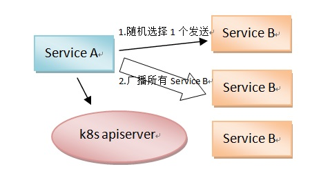

# 本例的典型架构

# 例子主要文件介绍

文件名            | 说明
-------------- | --------------------
build.sh       | 构建 服务A 服务B 的docker镜像
Dockerfile     | 服务A 服务B 的Dockerfile
k8s_api.go     | 辅助服务发现
service_a.go   | 服务A 实现
service_a.yaml | 服务A k8s编排脚本
service_b.go   | 服务B 实现
service_b.yaml | 服务B k8s编排脚本

# 编排脚本

与example2完全一样，除了 namespace、port 不同，避免重复冲突。

原理同example2，利用StatefulSet Pod有唯一ID， 这样 Pod 与 Net Session 可以一一对应。通过 Pod ID，来维护Net Session。

即 Pod的唯一ID，可以作为 服务ID 或 服务ID 的一部分。

# 服务A介绍

- 新进 服务B 网络回话 服务A 每5秒 GetEndpoints("k8s-example3", "service-b") 一次，检查是否有新进 服务B。有则连接之。

- 某 服务B 失效 服务A 与 服务B 有TCP连接，服务B失效，服务A马上感知。

- 服务A 与 服务B 互连，因此可以广播消息，或者单独发送等。

# 服务B介绍

与example2 的 服务B 完全一样。 不再介绍。

# 总结

- 需要通过 k8s_api.go 文件中的 2个 函数，来达成服务发现。
- 这个2个函数是简单且通用的。
- 并有2个约定的硬编码：namespace、service。
- 通过StatefulSet Pod有唯一ID，来达成网络回话的维护。
- 服务A 一定的延迟 发现 服务B。
- 服务A 马上感知 服务B失效。
